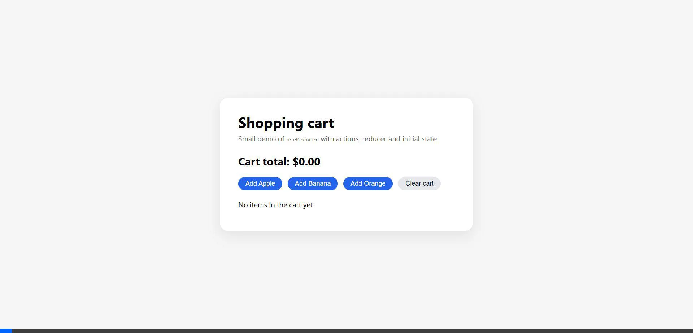
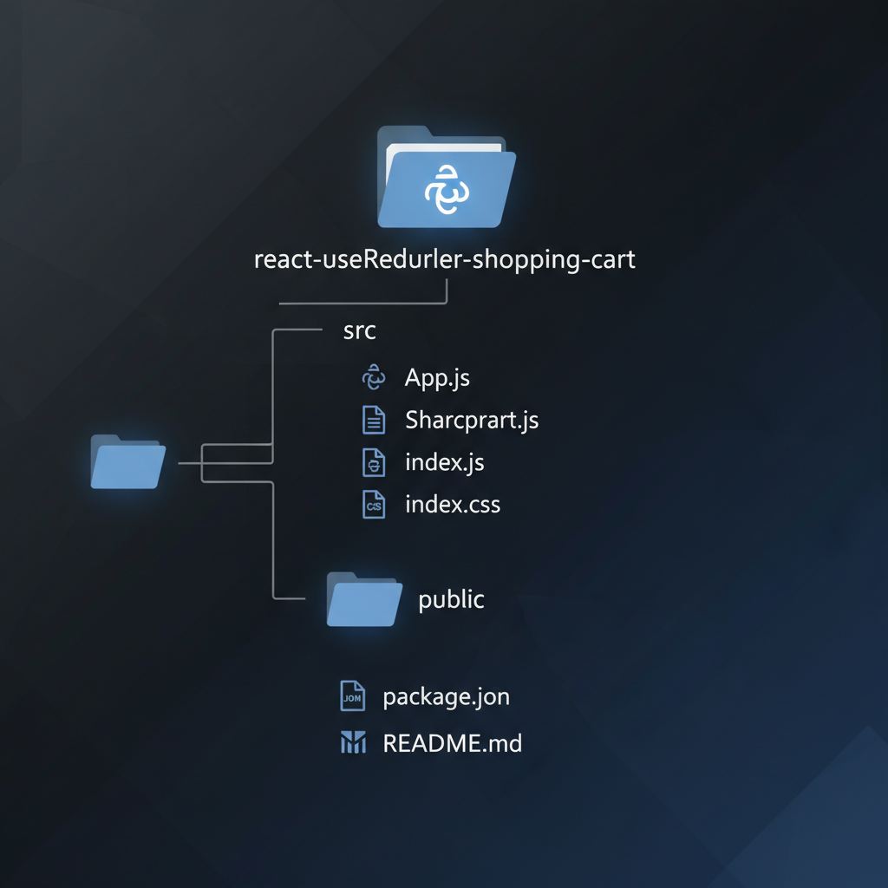

# React useReducer Shopping Cart sample

This is a minimal React app that demonstrates how to use `useReducer` to
manage the state of a simple shopping cart.

## Features

- **Add Items**: Add predefined products (Apple, Banana, Orange) to the cart.
- **Quantity Aggregation**: Adding the same item multiple times increases its quantity instead of creating duplicates.
- **Total Calculation**: Automatically calculates the total price of items in the cart.
- **Clear Cart**: Remove all items from the cart with a single click.
- **Persistent IDs**: Uses static IDs for products to ensure correct aggregation.

## How to run

1. Make sure you have **Node.js 18+** installed.
2. Unzip this project.
3. In a terminal, go to the project folder and run:

   ```bash
   npm install
   npm start
   ```

4. Your browser should automatically open at `http://localhost:3000`.

## Verification

Here is a video demonstrating the application functionality:



## Code Explanation

The project is structured around two main components: `App.js` and `ShoppingCart.js`.

### 1. App.js

This is the main entry point. It sets up the page structure and renders the `ShoppingCart` component.

```javascript
function App() {
  return (
    <div className="app">
      <div className="card">
        <h1>Shopping cart</h1>
        {/* ... header text ... */}
        <ShoppingCart />
      </div>
    </div>
  );
}
```

### 2. ShoppingCart.js

This component contains the core logic and UI.

#### State Management

We use `useReducer` to manage the complex state of the cart (items and total price).

**Initial State:**

```javascript
const initialCart = {
  items: [],
  total: 0,
};
```

**Reducer Logic (`cartReducer`):**

The reducer handles actions to modify the state. The `add_item` action is particularly interesting as it handles both adding new items and incrementing quantities of existing ones.

```javascript
case "add_item": {
  const existingItem = state.items.find(
    (item) => item.id === action.item.id
  );
  const updatedItems = existingItem
    ? state.items.map((item) =>
        item.id === action.item.id
          ? { ...item, quantity: item.quantity + action.item.quantity }
          : item
      )
    : [...state.items, action.item];
    
  // ... calculates new total ...

  return {
    ...state,
    items: updatedItems,
    total: newTotal,
  };
}
```

#### Component Logic

The `ShoppingCart` component renders the product list and the cart items.

-   **Adding Items:**
    When a user clicks "Add", `handleAddItem` dispatches an action:

    ```javascript
    function handleAddItem(product) {
      dispatch({
        type: "add_item",
        item: { ...product, quantity: 1 },
      });
    }
    ```

-   **Displaying Items:**
    The component maps over `products` to create buttons and `cart.items` to display the list.

    ```javascript
    {cart.items.map((item) => (
      <li key={item.id}>
        {item.name} - {item.quantity} x {formatCurrency(item.price)}
      </li>
    ))}
    ```

## Project Structure

Here is an overview of the project's file structure:



-   **`src/`**: Contains the source code.
    -   **`App.js`**: The main application component.
    -   **`ShoppingCart.js`**: The shopping cart component and logic.
    -   **`index.js`**: The entry point for React.
    -   **`index.css`**: Global styles.
-   **`public/`**: Static assets.
    -   **`index.html`**: The main HTML file.
-   **`package.json`**: Project dependencies and scripts.
-   **`README.md`**: Project documentation.

